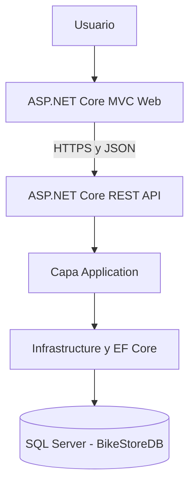
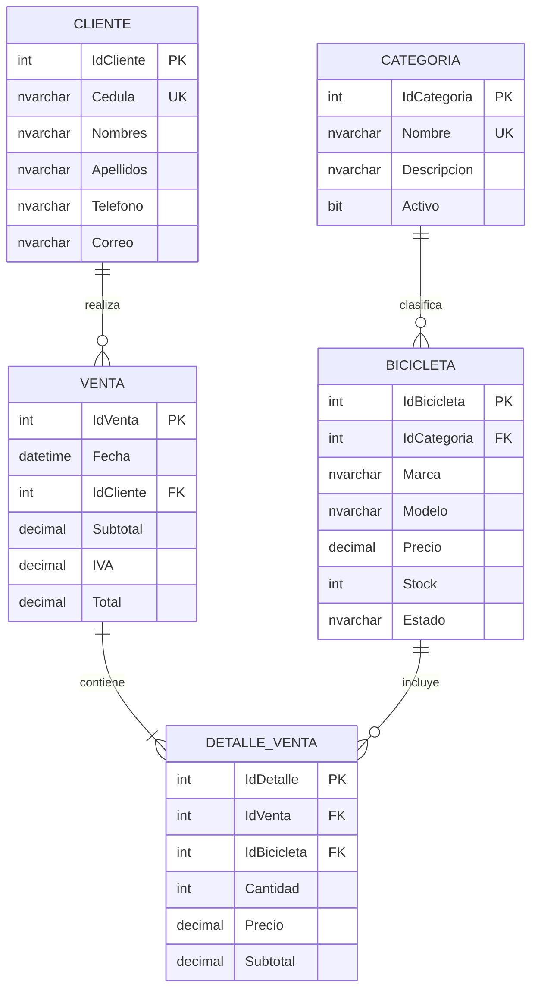
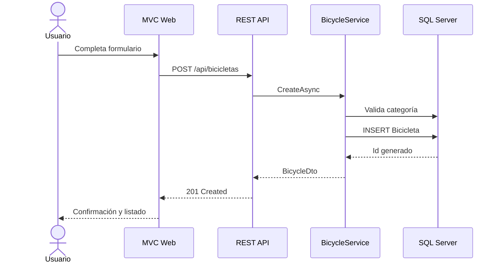
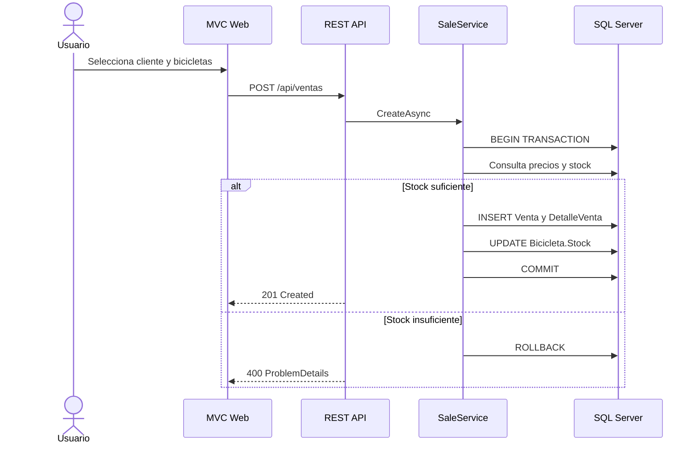

# Diagramas de diseño

## Arquitectura

```mermaid
flowchart TD
    U[Usuario] --> W[ASP.NET Core MVC Web]
    W -->|HTTPS y JSON| A[ASP.NET Core REST API]
    A --> S[Capa Application]
    S --> R[Infrastructure y EF Core]
    R --> D[(SQL Server - BikeStoreDB)]
```

## Modelo entidad-relación

```mermaid
erDiagram
    CATEGORIA ||--o{ BICICLETA : clasifica
    CLIENTE ||--o{ VENTA : realiza
    VENTA ||--|{ DETALLE_VENTA : contiene
    BICICLETA ||--o{ DETALLE_VENTA : incluye
    CATEGORIA {
      int IdCategoria PK
      nvarchar Nombre UK
      nvarchar Descripcion
      bit Activo
    }
    BICICLETA {
      int IdBicicleta PK
      int IdCategoria FK
      nvarchar Marca
      nvarchar Modelo
      decimal Precio
      int Stock
      nvarchar Estado
    }
    CLIENTE {
      int IdCliente PK
      nvarchar Cedula UK
      nvarchar Nombres
      nvarchar Apellidos
      nvarchar Telefono
      nvarchar Correo
    }
    VENTA {
      int IdVenta PK
      datetime Fecha
      int IdCliente FK
      decimal Subtotal
      decimal IVA
      decimal Total
    }
    DETALLE_VENTA {
      int IdDetalle PK
      int IdVenta FK
      int IdBicicleta FK
      int Cantidad
      decimal Precio
      decimal Subtotal
    }
```

## Secuencia: registrar bicicleta

```mermaid
sequenceDiagram
    actor Usuario
    participant Web as MVC Web
    participant Api as REST API
    participant App as BicycleService
    participant Db as SQL Server
    Usuario->>Web: Completa formulario
    Web->>Api: POST /api/bicicletas
    Api->>App: CreateAsync
    App->>Db: Valida categoría
    App->>Db: INSERT Bicicleta
    Db-->>App: Id generado
    App-->>Api: BicycleDto
    Api-->>Web: 201 Created
    Web-->>Usuario: Confirmación y listado
```

## Secuencia: registrar venta

```mermaid
sequenceDiagram
    actor Usuario
    participant Web as MVC Web
    participant Api as REST API
    participant App as SaleService
    participant Db as SQL Server
    Usuario->>Web: Selecciona cliente y bicicletas
    Web->>Api: POST /api/ventas
    Api->>App: CreateAsync
    App->>Db: BEGIN TRANSACTION
    App->>Db: Consulta precios y stock
    alt Stock suficiente
        App->>Db: INSERT Venta y DetalleVenta
        App->>Db: UPDATE Bicicleta.Stock
        App->>Db: COMMIT
        Api-->>Web: 201 Created
    else Stock insuficiente
        App->>Db: ROLLBACK
        Api-->>Web: 400 ProblemDetails
    end
```
